  

  
  
  
  

### Hey, I'm Maximiliano 👋

Linux nerd since I was 14. I love a good technical challenge, I like building simple things that are actually useful, and agentic AI is now a core part of how I build software.

- 🛠️ **Software Engineer at Modyo** · 2023 – Present · Full-time, remote
- 📍 Valdivia, Chile · GMT-4

### 🧭 Current quest — Modyo

- Core features for a CRM/CMS platform with **Ruby on Rails** and **React**: complex form builders and configurable workflows
- Led the refactor of the **roles and permissions** system, improving scalability and reducing technical debt
- **SQL** and data-access optimization for high-volume environments
- Components with **Hotwire** (Turbo + Stimulus) for better UX and front-end performance
- Third-party API integrations for authentication, notifications and data processing
- Financial products focused on automation, traceability and regulatory compliance

### ⚔️ Skills

**Backend** 

**Frontend** 

**Tools** 

**Side projects** 

**Agentic AI** 

### 🗺️ Quests

| | Repo | What it is | |
|---|---|---|---|
| 🔴 **Main** | [sin-punishment-recompiled](https://github.com/maximilianoide/sin-punishment-recompiled) | Work-in-progress native PC port via N64Recomp and RT64 | C++ |
| 🔵 Side | [aoc-templates](https://github.com/maximilianoide/aoc-templates) | Templates for Advent of Code | Ruby |
| 🔵 Side | [superpowers-ruby](https://github.com/maximilianoide/superpowers-ruby) | Claude Code skills library for Ruby and Rails projects (fork of [lucianghinda/superpowers-ruby](https://github.com/lucianghinda/superpowers-ruby)) | Shell |

### 🏆 Achievements

- ✅ EF SET English Certificate — C2 Proficient
- ✅ Nate Berkopec — The Complete Guide to Rails Performance
- ✅ Pragmatic Studio — Hotwire for Rails Developers
- ✅ Pragmatic Studio — Ruby Blocks & Iterators
- ⏳ AWS Certified Cloud Practitioner — *in progress*
- ⏳ AWS Certified AI Practitioner (AIF-C01) — *in progress*

### 💬 Languages

Spanish (native) · English (C2, EF SET Proficient) · Portuguese (competent)

### 🎮 Off duty

🍺 Beer · 🎸 🎹 Playing guitar and piano · 🎮 Former high-ranked LoL and Valorant player · 🥊 Combat sports

🎓 Universidad Austral de Chile — B.S. in Computer Science (incomplete studies), 2018 – 2022

